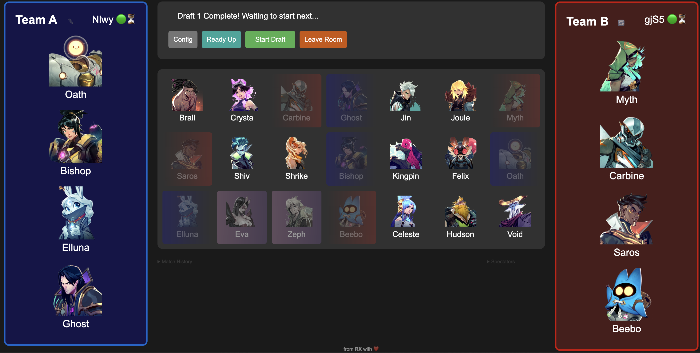

# SUPERVIVE Arena Draft

This is a fan-made unofficial draft simulator tool for SUPERVIVE arena used in scrim and tournament format experimentation. It was messily built out with lots of help from LLMs. A few days of effort got it working for this community's particular purposes including several prize pool events.

# Features

Bans alternate back and forth between teams

Pick order depends on the config mode selected
* Snake: A-BB-AA-BB-A
* Alt: A-BB-A-B-AA-B

General config options
* Try offline or create/join/spectate lobbies hosted on Firebase
* Set a 30-second timer for each ban and pick (not enforced yet)
* Remove or increase ban counts
* Hunter mirror or exclusivity

Pending feature requests/improvements
* Allow arbitrarily configurable pick/ban order
* Make the UI not bad
* Make the code not bad
* Hunter clones?
* Load lighterweight images for slow connection speeds

# Sample screenshot

Try it out at https://alzuri.github.io/supervive-arena-draft