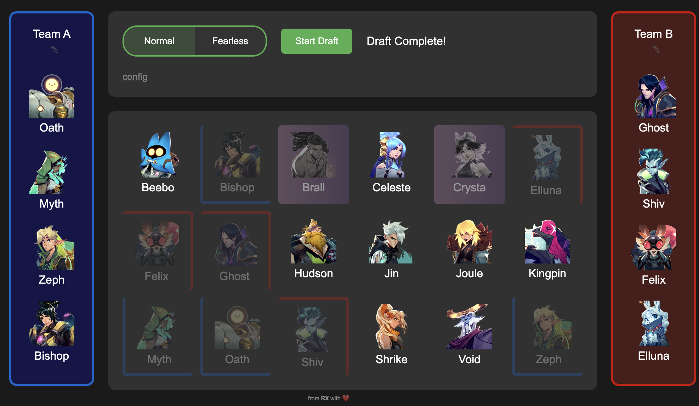

# SUPERVIVE Arena Draft

This is a very simple unofficial and offline draft simulator tool that is used for early day scrim and tournament experimentation.

# Features

Ban/pick follows the "snake" draft order of
* team 1 ban
* team 2 ban
* team 1 pick 1
* team 2 pick 1 2
* team 1 pick 2 3
* team 2 pick 3 4
* team 1 pick 4

Game modes
* "Normal" draft mode is what you'd expect!
* "Fearless" removes hunters from each team's pick pool in future games. Note that depending on bans and match length, you can currently run out of picks.
* Might add a "Random" mode that autoselects everything

General config options
* Set a 30-second timer for each ban and pick
* Allow for hunter mirror matches
* Remove or increase ban counts

# Sample screenshot

Try it out at https://alzuri.github.io/supervive-arena-draft